
<h1 align="center">停车场管理系统</h1>

## 简介
停车场管理系统：角色分为管理员和用户；主要功能包括个人中心、车辆管理、车位管理、预约管理、违规管理及公告管理，实现高效的停车场信息管理和操作便捷。    --计算机毕业设计源码；毕设源码；java毕业设计源码

## 联系方式

<h3 align="center">获取完整代码与数据库文件 + 微信：deepguan QQ: 86050149 QQ群: 783742310</h3>

<h3 align="center">可帮忙远程部署 包运行成功！提供远程部署、修改代码、设计文档指导、代码讲解等服务！</h3>

## 功能介绍（完整见运行截图）
管理员：基本功能包括登录、退出和个人信息管理。管理员可以通过左侧导航栏访问个人中心、员工管理、用户管理、车辆管理、车位管理、预约管理、公告管理、违规管理和基础数据管理等功能模块。可进行密码修改、添加车位、上传车位照片、简介编辑、公告管理以及违规记录录入与管理等操作。具有最高权限，可查看、修改及删除系统中的各项记录。

用户：主要功能包括车辆信息管理、车位预订以及违章查询。用户可以通过个人中心查看和修改账户信息，并进行充值操作。可通过输入框和上传功能进行预约和记录停车信息，查询违规信息并进行相关操作。还能够浏览并参与公告活动，管理个人和车辆的相关数据。界面简洁实用，为用户提供车辆管理和便利的停车服务。

## 运行截图
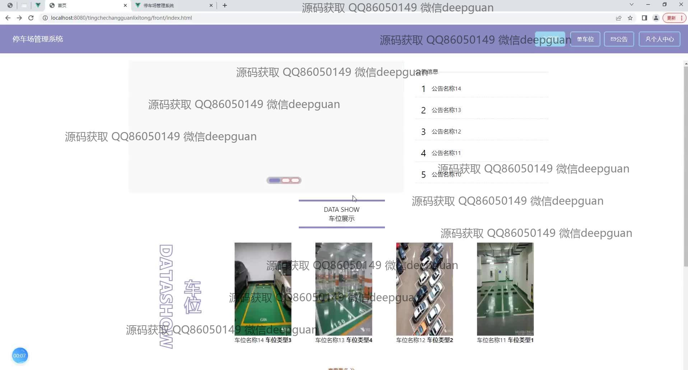
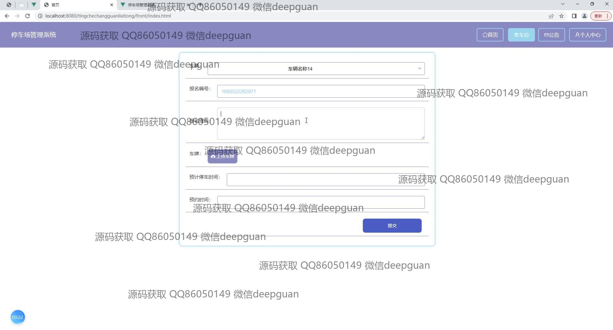
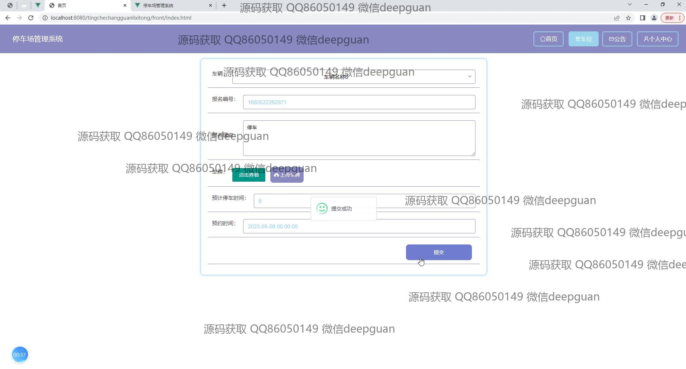
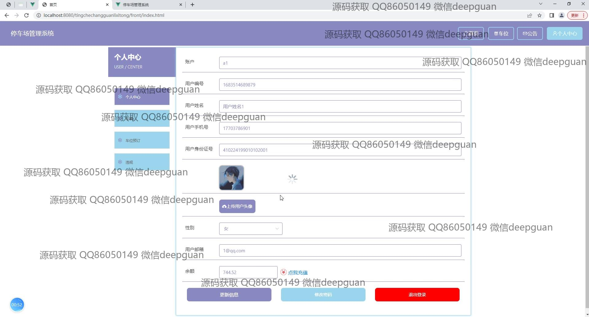
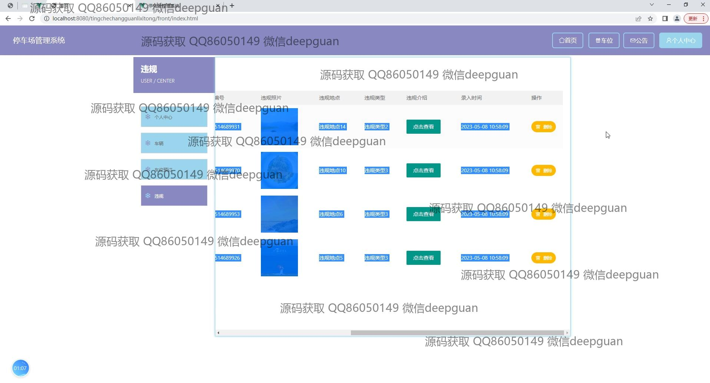
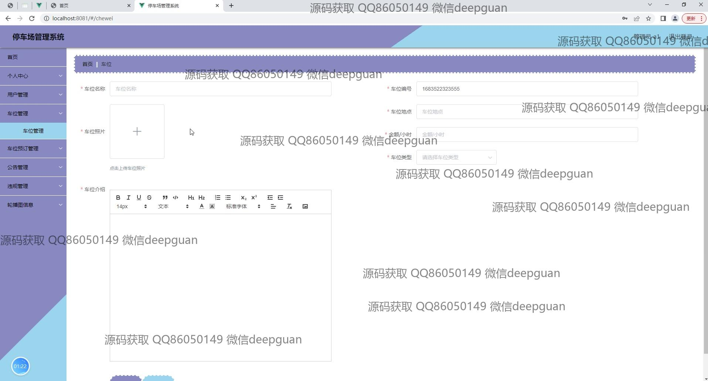
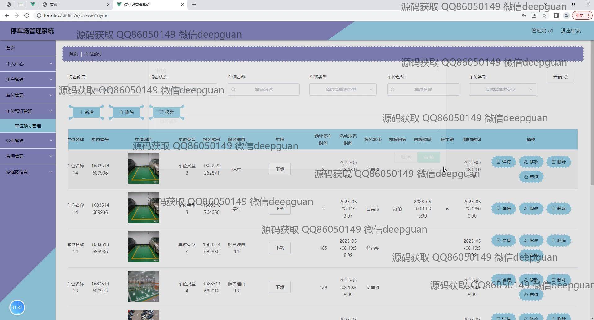
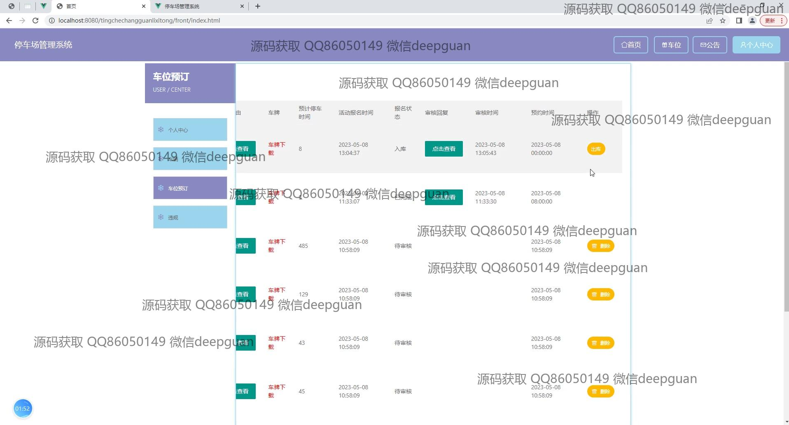
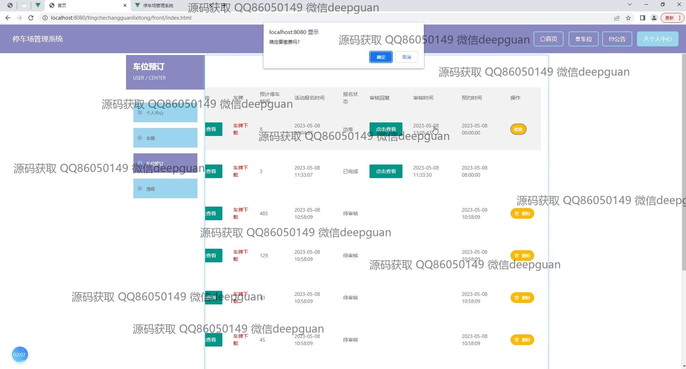
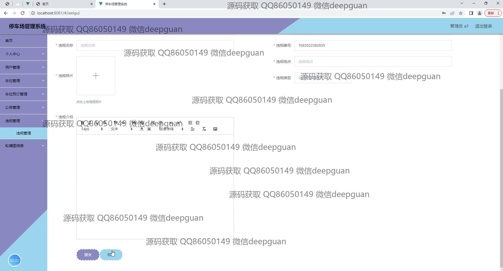
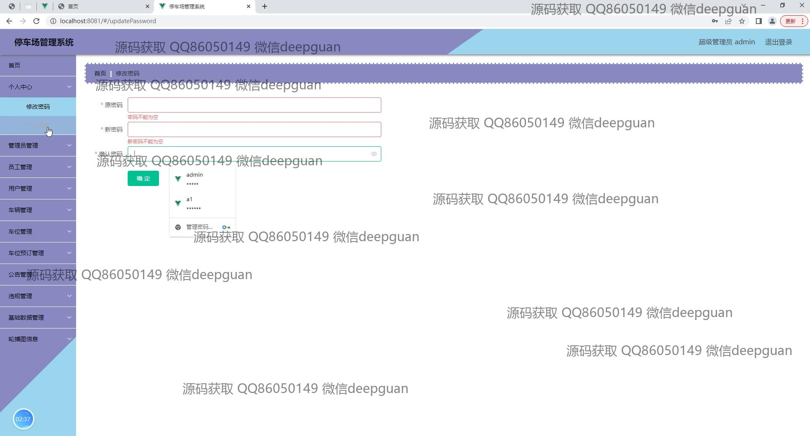
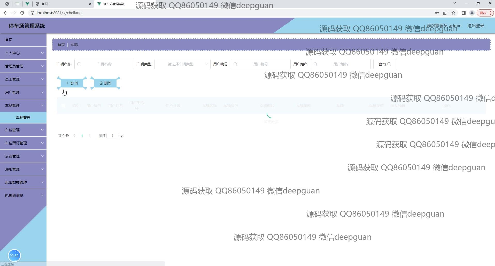
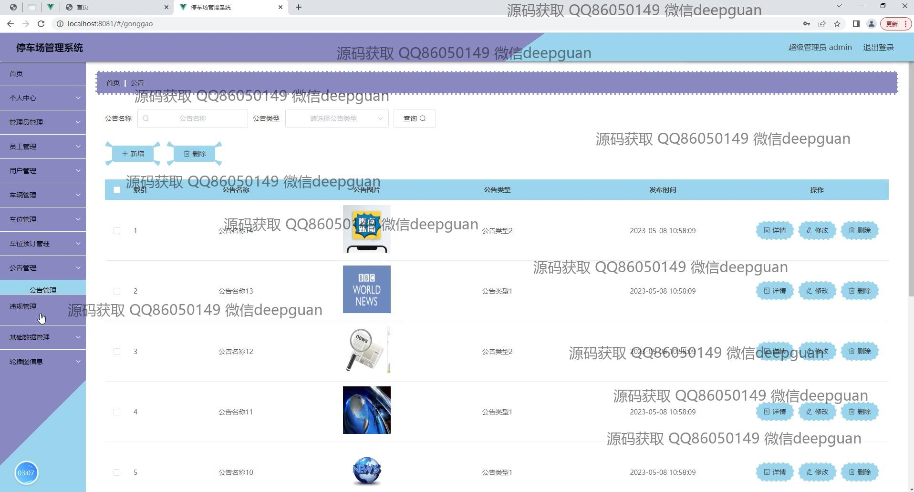

本代码来源于网络,仅供学习参考使用!

